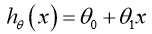
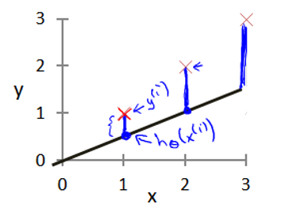
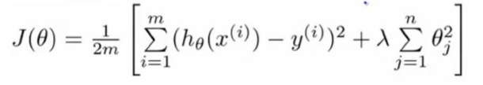

# 机器学习笔记

> 北邮网工2016级张婷旖

## 第一周

### 1一些概念

机器学习：让机器试着模仿人的大脑学习

一般定义：一个程序被认为能从经验 E 中学习，解决任务 T，达到性能度量值P，当且仅当，有了经验 E 后，经过 P 评判，程序在处理 T 时的性能有所提升。我认为经验e 就是程序上万次的自我练习的经验而任务 t 就是下棋。性能度量值 p 呢，就是它在与一些新的对手比赛时，赢得比赛的概率。 

学习算法：

#### 监督学习：

教计算机如何去完成任务

- eg：房价预测，给算法一个数据集，给出一系列房子数据以及每个样本的正确价格，然后运用学习算法，算出更多的正确答案，预测房价。（回归问题，因为结果数值连续）
  - 
  - 直线拟合；二次方程拟合
- 查看病历，根据肿瘤大小推测乳腺癌良性与否：结果只有0或1，实际是分类问题。此问题中只有一个特征，若有多个特征，可以采用支持向量机SVM
  - 
- 区分垃圾邮件

#### 非监督学习：

让计算机自己学习，已知数据集没有标签，没有提前告知算法信息

聚类算法（自动地找到数据中的某些结构）

- eg：新闻事件分类

### 2单变量线性回归(Linear Regression with One Variable) 

#### 模型表示

eg：房价预测

| m            | 代表训练集中实例的数量                 |
| ------------ | -------------------------------------- |
| x            | 代表特征/输入变量                      |
| y            | 代表目标变量/输出变量                  |
| (x,y)        | 代表训练集中的实例                     |
| (x(i),y(i) ) | 代表第 i 个观察实例                    |
| h            | 代表学习算法的解决方案或函数hypothesis |

h 根据输入的 x 值来得出 y 值，y 值对应房子的价格 因此，h 是一个从x 到 y 的函数映射

只含有一个特征/输入变量，因此这样的问题叫作单变量线性回归问题。 

#### 代价函数Cost Function 

模型所预测的值与训练集中实际值之间的差距（下图中蓝线所指）就是建模误差（modeling error）。

 

目标：选出可以使得建模误差的==平方和==能够最小的模型参数，使得代价函数                 

最小（其他代价函数也可，但是平方误差代价函数最常用）

在三维空间中存在一个使得 J(θ~0~,θ~1~)最小的点

每个圈表示所有使得 J(θ~0~,θ~1~)相等的点的集合

图二红色标记处已经很接近最小值，此时将θ~0~,θ~1~代入假设函数，可以得到图一所示预测函数，可以看到预测结果还不错

#### 梯度下降Gradient Descent 

梯度下降是一个用来求函数最小值的算法，我们==使用梯度下降算法来求出代价函数 J(θ~0~,θ~1~) 的最小值==

- 开始时我们随机选择一个参数的组合（θ0,θ1,...,θn），计算代价函数 J(θ~0~,θ~1~) ，然后我们寻找下一个能让代价函数值下降最多的参数组合。我们持续这么做直到到到一个局部最小值。选择不同的初始参数组合，可能会找到不同的局部最小值。 

可以抽象成下山问题

α学习率（learning rate）：决定了我们沿着能让代价函数下降程度最大的方向向下迈出的步子有多大

批量梯度下降（batch gradient descent）算法的公式：

*注意：要同时更新 θ0 和 θ1

- α 太小：就需要很多步才能到达最低点，很慢 
- α 太大：梯度下降法可能会越过最低点，离最低点越来远，甚至可能无法收敛，发散
- 若 θ1初始化在局部最低点，局部最优点的导数将等于零，梯度下降法更新不改变参数的值。（这也解释了为什么即使学习速率 α 保持不变时，梯度下降也可以收敛到局部最低点）

梯度下降一步后，新的导数会变小一点点。随着梯度下降法的运行，你移动的幅度会==自动==变得越来越小，直到最终收敛到局部极小值。

#### 梯度下降的线性回归 GradientDescentForLinearRegression

将梯度下降和代价函数结合，并将其应用于具体的拟合直线的线性回归算法里

二者结合，称为批量梯度下降（梯度下降的每一步中，我们都用到了所有的训练样本，这是一种迭代的算法）：

*另，有一种计算代价函数 J 最小值的数值解法，不需要梯度下降这种迭代算法——正规方程(normal equations)，在<u>数据量较大</u>的情况下，梯度下降法比正规方程要更适用一些

#### 题目

## 第二周

### 3多变量线性回归(Linear Regression with Multiple Variables) 

#### 多维特征

多元线性回归（Multivariate Linear Regression）是多个变量的线性回归函数。初始作如下定义：

- n --- 特征的数量
- x^(i)^ --- 第i个样本
- x~j~^(i)^ --- 第i 个样本的第 j 个特征

支持多变量的假设函数h（Hypothesis）：

n+1 个参数和 n 个变量

为了简化，定义： 

则可将  和  写成 n+1 维的向量：

特征矩阵 X 的维度是 m*(n+1)。

则可定义成：

#### 多变量梯度下降Gradient Descent for Multiple Variables 

在多变量线性回归中，我们也构建一个代价函数

是要找出使得代价函数最小的一系列参数，多变量线性回归的批量梯度下降算法为：

即：

求导后：

#### 梯度下降法实践——特征缩放 Feature Scaling

面对多维特征问题的时候，我们要保证这些特征都具有相近的尺度，这将帮助梯度下降算法更快地收敛。 

eg：以房价问题为例，假设我们使用两个特征，房屋的尺寸和房间的数量，尺寸的值为 0-2000 平方英尺，而房间数量的值则是 0-5，两种特征尺度差距很大，图像显得很扁，梯度下降算法需要非常多次的迭代才能收敛。

尝试将所有特征的尺度都尽量归一化于 （0,1） 之间，可加快梯度下降的收敛。

最简单的方法是采用均值归一化（Mean normalization），给出定义如下：

其中，μ~i~ 为均值，S~i~ 为取值范围的最大值减去最小值。

#### 梯度下降法实践——学习率  Learning Rate 

梯度下降算法收敛所需要的迭代次数根据模型的不同而不同，我们可以绘制迭代次数和代价函数 J(θ) 的图表来观测算法在何时趋于收敛：

迭代受到学习率α 的影响，α过小，则达到收敛所需的迭代次数会非常高；α 过大，可能会越过局部最小值导致无法收敛

#### 特征和多项式回归 Features and Polynomial Regression  

eg：房价预测问题

X1=frontage（临街宽度），x2=depth（纵向深度），x=frontage*depth=area（面积），则： 

线性回归并不适用于所有数据，有时我们需要曲线来适应我们的数据，比如一个二次方模型或三次方模型：

！！通常我们需要先观察数据然后再决定准备尝试怎样的模型！！

对于： 

可令： 

从而将模型转化为线性回归模型。 

对于这种情况，不同变量之间的取值范围可能相差很大，特征缩放是必要的。

*有时也可采用平方根进行拟合：

#### 正规方程Normal Equation 

对于某些线性回归问题，正规方程是更好的解决方案，如：

正规方程是通过求解：，来找出使得代价函数最小的参数θ，

假设训练集特征矩阵为 X（包含了 x0=1），训练集结果为向量 y，则：

对于不可逆的矩阵（通常是因为特征之间不独立，或特征数量大于训练集的数量），正规方程方法是不能用的

==梯度下降与正规方程的比较==： 

只要特征变量的数目并不大，标准方程是一个很好的计算参数 θ 的替代方法。 实际上对于那些算法，并不能使用标准方程法。对于那些更复杂的学习算法，我们将不得不仍然使用梯度下降法。

#### 正规方程及不可逆性 Normal Equation Noninvertibility 

不可逆：

1. 算数不可逆
   - 发生的可能性很小，几乎可以忽略
2. 样本数m 小于或等于 特征数n 的时候，可能会导致矩阵 X'X 的结果是不可逆的
   - 可以使用一种叫做正则化的线性代数方法，删除某些特征或者是使用某些技术解决这个问题（eg：特征x1 和 x2 是线性相关的，互为线性函数。当有一些多余的特征时，可以删除这两个中的一个，无须同时保留）

称那些不可逆矩阵为奇异或退化矩阵

Octave 里，有两个函数可以求解矩阵的逆：

- pinv()：伪逆【使用 pinv() 函数可以展现数学上的过程，计算出 θ 的值，即便矩阵 X'X是不可逆的】
- inv()：逆

#### 题目

## 第三周

### 4逻辑回归(Logistic Regression) 

#### 分类问题

尝试预测的是结果是否属于某一个类（例如正确或错误）

eg：判断一封电子邮件是否是垃圾邮件；判断一次金融交易是否是欺诈；区别一个肿瘤是恶性的还是良性的

假设函数的值可能远大于1或远小于0，但函数输出结果y永远等于1或0，这有点奇怪，于是我们在研究逻辑回归算法时，固定输出值y永远在之间

逻辑回归算法实际上是一种分类算法

#### 假说表示 Hypothesis Representation 

引入逻辑回归模型，该模型的输出变量范围始终在 0 和 1 之间。 

X：代表特征向量 

g：逻辑函数（logistic function），常用的逻辑函数为 S 形函数：

合起来，我们得到逻辑回归模型的假设：

对于给定的 x，通过已经确定的参数计算得出 hθ(x)=0.7，则表示有 70%的几率 y 为正向类，相应地 y 为负向类的几率为 1-0.7=0.3。 

#### 决策边界Decision Boundary 

因为：

- 当 h~θ~大于等于 0.5 时，预测 y=1 
- 当 h~θ~小于 0.5 时，预测 y=0 

故：

- θ^T^X 大于等于 0 时，预测 y=1 
- θ^T^X 小于 0 时，预测 y=0 

则有：

- 

- 参数 θ 是向量[-3 1 1]。 则当-3+x1+x2 大于等于 0，即x1+x2 大于等于 3 时，模型将预测 y=1

- 我们可以绘制直线 x1+x2=3，这条线便是我们模型的分界线，，将预测为 1 的区域和预测为 0 的区域分隔开

- 

- 若：

  

  需要用曲线才能分隔 y=0 的区域和 y=1 的区域，假设参 数：

  

  则决策边界恰好为圆心在原点且半径为1的圆

#### 代价函数Cost Function 

如何拟合逻辑回归模型的参数θ

对于线性回归模型，我们定义的代价函数是所有模型误差的平方和

若逻辑回归模型沿用此定义，我们将代入代价函数时，得到的将是一个非凸函数non-convex function：

非凸函数局部最小值很多，这将影响梯度下降算法寻找全局最小值。

故我们重新定义逻辑回归的代价函数：

hθ(x)与 Cost(hθ(x),y)之间的关系：

当实际的 y=1 且 hθ也为 1 时误差为 0，当 y=1 但 hθ不为 1 时误差随着 hθ 的变小而变大；当实际的 y=0 且 hθ 也为 0 时代价为 0，当 y=0 但 hθ不为 0 时误差随着 hθ 的变大而变大

用梯度下降算法来求得能使代价函数最小的参数：

求导后：

这里的 hθ(x)=g(θTX)与线性回归中不同，所以实际上是不一样的

在运行梯度下降算法之前，进行特征缩放依旧是非常必要的。

#### 简化的成本函数和梯度下降 Simplified Cost Function and Gradient Descent

逻辑回归的代价函数：

要找到使得代价函数值最小的参数θ：

- 梯度下降法：
  - 
  - 求导后：
  - 化简后：
  - 有n个θ值需要同时更新
  - 
- 为了增大梯度下降的执行速度，可以使用特征缩放

#### 高级优化Advanced Optimization 

用来优化梯度下降，提高逻辑回归的速度

使用高级优化如：共轭梯度法 BFGS (变尺度法) 和 L-BFGS (限制变尺度法) 等，通常不需要手动选择学习率 α，他们可以利用线性搜索算法自动尝试并选择一个好的α

高级优化算法，让算法使用变得模糊、难调试，但这些算法的运行速度通常远远超过梯度下降

#### 多分类问题Multiclass Classification_ One-vs-all 

将多个类中的一个类标记为正向类（y=1），然后将其他所有类都标记为负向类

### 5正则化(Regularization) 

主要是为了解决Overfitting 

#### 过拟合问题 Overfitting 

线性模型：

分类模型：

欠拟合：无法适应训练集

过拟合：非常好的适应训练集但在输入测试集时效果可能很差——>丢弃某些无用特征；正则化（保留所有特征，但是减少参数的大小）

#### 代价函数 Cost Function 

高次项导致了过拟合的产生，所以如果我们能让这些高次项的系数接近于 0 的话，我们就能很好的拟合了，这就是正则化的基本方法。 

可以在代价函数的高次项部分引入惩罚函数，无法确定我们应该惩罚哪些特征时，可以对所有的特征进行惩罚，并且让代价函数最优化的软件来选择这些惩罚的程度

 λ ：正则化参数Regularization Parameter

一般不对θ~0~进行惩罚

 λ 过大，则会把所有的参数都最小化了，导致模型变成 h~θ~(x)=θ~0~ ，造成欠拟合underfit（ 当λ没有选择好时,可能会导致训练效果还不如不加的λ好）

#### 正则化线性回归 Regularized Linear Regression

线性回归求解：

1. 梯度下降
   - 
2. 正规方程
   - 

#### 正则化逻辑回归Regularized Logistic Regression

两种优化算法：

1. 梯度下降
2. 高级优化算法：自己设计代价函数和计算导数

#### 题目

将正则化方法加入模型并不是每次都能取得好的效果,如果λλ取得太大的化就会导致欠拟合. 这样不论对traing set 还是 examples都不好

more features能够更好的fit 训练集,同时也容易导致overfit，新加的feature会提高train set的拟合度,而不是example拟合度

## 第四周

### 6神经网络Neural Networks

#### 非线性假设 Non-linear Hypotheses 

线性、逻辑回归的缺点：特征太多时计算负荷很大

#### 模型表示1 Model Representation 

x1,x2,x3是输入单元（input units），输入原始数据。a1,a2,a3是中间单元，负责数据处理，呈递到下一层。 最后是输出单元，负责计算 hθ(x)。 每一层的输出变量都是下一层的输入变量。

下图为一个 3 层的神经网络，第一层成为输入层（Input Layer），最后一层称为输出层（Output Layer），中间一层成为隐藏层（Hidden Layers）。我们为每一层都增加一个偏差单位（bias unit）： 

a~i~^(j)^：第 j 层的第 i 个激活单元。

θ^(j)^ ：从第 j 层映射到第 j+1 层时的权重的矩阵

例如 θ^(1)^ 代表从第一层映射到第二层的权重的矩阵。其尺寸为：以第 j+1 层的激活单元数量为行数，以第 j 层的激活单元数加一为列数的矩阵。上图所示的神经网络中的尺寸为 3*4。

对于上图所示的模型，激活单元和输出分别表达为： 

每一个 a 都是由上一层所有的 x 和每一个 x 所对应的θ决定的

θ · X = a 

#### 模型表示2 Model Representation 

利用向量化的方法

我们可以把 a0,a1,a2,a3看成更为高级的特征值，x0,x1,x2,x3的进化体，它们是由 x 与决定的，因为是梯度下降的，所以 a 是变化的，并且变得越来越厉害，比起x，a能更好的预测新数据

这是神经网络相比于逻辑回归和线性回归的优势。 

#### 特征和直观理解 1  Examples and Intuitions I

普通的逻辑回归中，我们只能使用原始特征x~1~,x~2~,...,x~n~，在神经网络中，原始特征只是输入层，我们可以认为中间层的特征是神经网络通过学习后自己得出的一系列用于预测输出变量的新特征

我们可以用这样的一个神经网络表示 AND 函数： 

- 
- 输出函数h(x)=g(-30+20x1+20x2)
- 
- 

 OR 函数： 

- 

#### 样本和直观理解 II Examples and Intuitions II 

我们可以用一个单一的神经网络激活层作为二元逻辑运算符,为了表示不同的运算符，选择不同的权重即可

我们可以利用神经元来组合成更为复杂的神经网络以实现更复杂的运算，如XNOR=（x1ANDx2 OR ((NOTx1)AND(NOTx2)) ：

(NOTx1)AND(NOTx2)：

将表示 AND 的神经元和表(NOTx1)AND(NOTx2)的神经元以及表示 OR 的神经元进行组合：

#### 多类分类 Multiclass Classification 

输入向量 x 有三个维度，两个中间层，输出层 4 个神经元分别用来表示 4 类，也就是每一个数据在输出层都会出现[a b c d]T，且 a,b,c,d 中仅有一个为 1，表示当前类

#### 题目

## 第五周

### 7神经网络的学习

#### 代价函数Cost Function 

m 训练样本数目

x 一组输入 

y 一组输出信号

L  神经网络层数

S~l~  每层的 neuron 个数

S~L~ 最后一层中处理单元的个数

神经网络的分类：

1. 二类分类：SL=1, y=0 or 1 表示哪一类； 
2. K 类分类：SL=K, yi = 1 表示分到第 i 类；（K>2） 
3. 

代价函数（h~θ~(x)是一个维度为 K 的向量）：

对于每一行特征，我们都会给出 K 个预测，然后利用循环在 K 个预测中选择可能性最高的一个，将其与 y 中的实际数据进行比较.归一化的那一项只是排除了每一层 θ0 后，每一层的 θ 矩阵的和.

#### ？？反向传播算法 Backpropagation Algorithm 

正向传播方法：从第一层开始正向一层一层进行计算，直到最后一层的 hθ(x)

采用一种反向传播算法，==为了计算代价函数的偏导==。

方法是首先计算最后一层的==误差==，然后再一层一层反向求出各层的误差，直到倒数第二层。

前向传播算法： 

- 
- 

后向传播算法：

- 从最后一层的误差开始计算，误差是激活单元的预测(a~k~^(4)^ )与实际值(y~k~)之间的误差(k=1:K)。 

- 我们用==δ== 来表示 ==误差==:
- 计算前一层的误差： 
- 其中 g'( z ^(3)^)是 S 形函数的导数, g'(z ^(3)^)=a^(3)^.*(1-a^(3)^)。(θ^(3)^) ^T^δ ^(4)^则是权重导致的误差和
- 第二层的误差： 
- 第一层是输入变量，不存在误差。
- 代价函数的偏导数，假设 λ=0，
  - 不做任何归一化处理时：
    - 
    - l 当前层数
      j 当前层中的激活单元的下标，也将是下一层的第 j 个输入变量的下标。 
      i 是受到权重矩阵中第 i 行影响的下一层中的误差单元 的下标。 
  - 考虑归一化处理：
    - 除了每层的误差单元之外，还需要计算整个训练集的误差单元，此时的误差单元也是一个矩阵，用表示
    - 首先用正向传播方法计算出每一层的激活单元，利用训练集的结果与神经网络预测的结果求出最后一层的误差，然后利用该误差运用反向传播法计算出直至第二层的所有误差。即得到
    - 算代价函数的偏导数：
      - 

#### 展开参数 Implementation Note_ Unrolling Parameters 

#### 梯度检验Gradient Checking 

对一个较为复杂的模型（例如神经网络）使用梯度下降算法，可能会存在一些不容易察觉的错误，为了避免这种问题，使用梯度数值检验（Numerical Gradient Checking）方法：通过估计梯度值来检验计算的导数值是否真的是我们要求的

估计梯度值的方法：在代价函数上沿着切线的方向选择离两个非常近的点，计算两个点的平均值用以估计（ε 是一个非常小的值，通常选取 0.001梯度）：

- 
- 当 θ 是一个向量时，我们则需要对偏导数进行检验，
- 我们针对每一个 θ 都计算一个近似的梯度值，将这些值存储于一个近似梯度矩阵中，最终将得出的这个矩阵同计算出的偏导数存储矩阵 进行比较

#### 随机初始化 Random Initialization 

对于逻辑回归来说初始所有参数为 0是可行的，但对于神经网络，如果令所有的初始参数都为 0，意味着第二层的所有激活单元都会有相同的值

#### summary

##### 使用神经网络的步骤：

1. 选择网络结构
   - 网络结构：即决定选择多少层以及决定每层分别有多少个单元。 
   - 第一层的单元数即训练集的特征数量。
   - 最后一层的单元数是训练集的结果的类的数量。 
   - 如果隐藏层数大于 1，确保每个隐藏层的单元个数相同，通常情况下隐藏层单元的个数越多越好。 
   - ==我们真正要决定的是隐藏层的层数和每个隐藏层的单元数。== 
2. 训练神经网络： 
   - 参数随机初始化 
   - 利用正向传播方法计算所有的 hθ(x) 
   - 编写计算代价函数 J 的代码 
   - 利用反向传播方法计算所有偏导数 
   - 利用数值检验方法检验这些偏导数 
   - 使用优化算法来最小化代价函数  

#### 自动化驾驶

观察人类驾驶，同时分析路况图像，训练得到一个与人类驾驶员操纵方向基本相近的结果

#### 题目

打破对称现象：使得第二层的各个特征值的值各不相同

## 第六周

### 8应用机器学习的建议

#### 决定下一步该做什么

当我们运用训练好了的模型来预测未知数据的时候发现有较大的误差，我们下一步可以做什么？ 

1. 获得更多的训练实例——通常是有效的，但代价较大，下面的方法也可能有效，可考虑先采用下面的几种方法。 
2. 减少特征的数量 
3. 获得更多的特征 
4. 增加多项式特征 
5. 减少归一化程度 λ 
6. 增加归一化程度 λ

以上的方法选择不应该是随机的、凭感觉的，我们可以运用一些机器学习诊断法来帮助判断，了解某种算法到底是否有用。通常也能够告诉你，要想改进一种算法的效果，什么样的尝试，才是有意义的。

#### 评估假设Evaluating a Hypothesis 

通常确定算法的参数的时候，我们考虑的是选择参量来使训练误差最小化；

但仅仅因为训练误差很小，并不能说明它就一定是一个好的假设函数（可能出现过拟合现象）

过拟合的判断：

- 对假设函数 h(x) 进行画图，然后观察图形趋势：
  - 
- 对于特征变量不止一个的这种一般情况，将数据分成训练集和测试集，通常用 70%的数据作为训练集，用剩下 30%的数据作为测试集。通常我们要对数据进行“洗牌”，然后再分成训练集和测试集。 
  - 
  - 测试集评估在通过训练集让我们的模型学习得出其参数后，对测试集运用该模型

#### 模型选择和交叉验证集 Model Selection and Train_Validation_Test Sets 

使用 60%的数据作为训练集，使用 20%的数据作为交叉验证集，使用 20%的数据作为测试集  

模型选择的方法为： 
1. 使用训练集训练各个模型 
2. 用 各个模型分别对交叉验证集计算得出交叉验证误差（代价函数的值） 
3. 选取代价函数值最小的模型 
4. 用步骤 3 中选出的模型对测试集计算得出推广误差（代价函数的值） 

#### 诊断偏差和方差 Diagnosing Bias vs. Variance

学习算法表现不理想时，可能有两种情况：偏差比较大；方差比较大（欠拟合或过拟合）

对于训练集： d 较小时，模型拟合程度低，误差大；随着 d 的增长，拟合程度提高，误差减小。 

对于交叉验证集： d 较小时，模型拟合程度低，误差大；随着 d 的增长，误差呈现先减小后增大的趋势，转折点是模型开始过拟合训练数据集的时候。交叉验证集误差较大，如何判断是方差还是偏差：

- 
- 训练集误差和交叉验证集误差近似时：bias/欠拟合 
- 交叉验证集误差远大于训练集误差时：variance/过拟合 
- 

#### 归一化和偏差Regularization and Bias_Variance

选择 λ 的值时要注意：

- 

- 我们选择一系列的想要测试的 λ 值，通常是 0-10 之间的呈现 2 倍关系的值（如 0,0.01,0.02,0.04,0.08,0.15,0.32,0.64,1.28,2.56,5.12,10 共 12 个）

- 

- 选择 λ 的方法为： 
  1. 使用训练集训练出 12 个不同程度归一化的模型 

  2. 用 12 模型分别对交叉验证集计算的出交叉验证误差 

  3. 选择得出交叉验证误差最小的模型 

  4. 运用步骤 3 中选出模型对测试集计算得出推广误差，我们也可以同时将训练集和交叉验证集模型的代价函数误差与 λ 的值绘制在一张图表上： 

    

-  λ 较小时，训练集误差较小（过拟合）而交叉验证集误差较大 

-  λ 增加，训练集误差不断增加（欠拟合），而交叉验证集误差则是先减小后增加 

#### 学习曲线Learning Curves 

使用学习曲线来判断某一个学习算法是否处于偏
差、方差问题

学习曲线是学习算法的一个很好的合理检验（sanity check）。将训练集误差和交叉验证集误差作为训练集实例数量（m）的函数绘制的图表

欠拟合：

- 
- 在高偏差/欠拟合的情况下，增加数据到训练集不一定能有帮助

过拟合：

- 
- 在高方差/过拟合的情况下，增加更多数据到训练集可能可以提高算法效果

#### 决定下一步做什么 Deciding What to Do Next Revisited

神经网络的方差和偏差： 

- 较小的神经网络，类似于参数较少的情况，容易导致高偏差和欠拟合，计算代价较小
- 较大的神经网络，类似于参数较多的情况，容易导致高方差和过拟合，计算代价较大，可以通过归一化手段来调整而更加适应数据
- 通常选择较大的神经网络并采用==归一化处理==会比采用较小的神经网络效果要好。
- 神经网络中的隐藏层的层数的选择：通常从一层开始逐渐增加层数 。
- 为了更好地作选择，可以把数据分为训练集、交叉验证集和测试集，针对不同隐藏层层数的神经网络训练神经网络， 然后选择交叉验证集代价最小的神经网络。 

### 9机器学习系统 的设计

#### 首先要做什么 what to do first

eg：垃圾邮件分类器spam

用邮件的特征x构造分类器，y表示垃圾邮件或非垃圾邮件，比如：

- 选择许多单词组成一个特征向量，看他们是否存在于待分类邮件中，存在则为1，不存在为0

- 选择最常出现的单词作为特征

- 如何改进算法提高分类器能力：一般来说数据越多准确度越高

- honeypot

- 垃圾邮件发送方发送垃圾邮件时，试图模糊邮件来源、起假标题或者使用不常见的服务器发送邮件

#### 误差分析Error Analysis 

研究机器学习的问题时，先使用一个很简单的学习算法迅速得出一个结果（可能并不完美），然后通过==交叉验证来检验数据==（亲自看一看哪些邮件被算法错误地分类。因此，通过这些被算法错误分类的垃圾邮件与非垃圾邮件，你可以发现某些系统性的规律：什么类型的邮件总是被错误分类。启发你如何去提高它）

一旦做完，你可以画出==学习曲线==，通过画出学习曲线，以及检验误差，来找出你的算法是否有高偏差和高方差的问题，或者别的问题。

之后，再来决定用更多的数据训练，或者加入更多的特征变量是否有用。

构建一个学习算法的推荐方法为： 
1. 从一个简单的能快速实现的算法开始，实现该算法并用==交叉验证集数据测试==这个算法 
2. ==绘制学习曲线==，决定是增加更多数据，或者添加更多特征，还是其他选择 
3. 进行==误差分析==：人工检查交叉验证集中我们算法中产生预测误差的实例，看看这些实例是否有某种系统化的趋势 

#### 类偏斜的误差度量Error Metrics for Skewed Classes

用分类精确度往往不准确，我们也无法知道算法改进后是否真的会提升分类模型的质量

评估度量值：通过一个数字来反映你的回归模型到底如何（可以避免算法的欺骗（仅仅通过预测y总是等于0 或者y总是等于1，它没有办法得到 高的查准率 和高的召回率））

设定误差度量值：设定某个实数来评估你的学习算法，并衡量它的表现

偏斜类（skewed classes）问题：训练集中有非常多的同一种类的实例，只有很少或没有其他类的实例，即正样本与负样本的数量相比非常少

- eg：用算法来预测癌症是否是恶性的，在我们的训练集中，只有 0.5%的实例是恶性肿瘤。假设我们编写一个非学习而来的算法，在所有情况下都预测肿瘤是良性的，那么误差只有 0.5%。然而我们通过训练而得到的神经网络算法却有 1%的误差。

查准率（Precision）和召回率（Recall） 我们将算法预测的结果分成四种情况：

- 

查准率：TP/（TP+FP）例，在所有我们预测有恶性肿瘤的病人中，实际上有恶性肿瘤的病人的百分比，越高越好。 

召回率：TP/（TP+FN）例，在所有实际上有恶性肿瘤的病人中，成功预测有恶性肿瘤的病人的百分比，越高越好。

如果一个分类模型，拥有高查准率和召回率，那么我们可以确信地说这个算法表现很好，即便我们拥有很偏斜的类 

#### 查全率和查准率之间的权衡  Trading Off Precision and Recall 

查准率：TP/（TP+FP）例，在所有我们预测有恶性肿瘤的病人中，实际上有恶性肿瘤的病人的百分比，越高越好。 

召回率：TP/（TP+FN）例，在所有实际上有恶性肿瘤的病人中，成功预测有恶性肿瘤的病人的百分比，越高越好。

一般用阈值0.5来预测真假，如果我们希望更高的查准率，我们可以使用比 0.5 更大的阀值，如 0.7，0.9；要提高召回率，可以使用比 0.5 更小的阀值，如 0.3

- 
- 选择阀值的算法：
  - 计算 F1 值（F1 Score），
  - 选择使得 F1 值最高的阀值
  - F1要大的话P\R都必须相对大，F1最大为1

####  机器学习的数据 Data For Machine Learning 

除评价指标外，机器学习系统设计中另一个重要的方面

有时我们希望获得更多数据而非修改算法

改变训练数据集大小，将学习算法用于不同大小的训练数据中，会得到不同的结果

- 大部分算法，都具有相似的性能
- 随着训练数据集的增大，这些算法的性能也都对应地增强了。

大量数据没有帮助的情况：

- 特征很少时，特征无用时

大量数据有帮助的情况：

- 特征有足够的信息量且我们有比较好的算法；

假设某种算法可以很好的拟合训练集，训练误差低——low bias；

假设有庞大的训练集，训练集就不大可能过拟合，此时训练误差很可能就接近测试误差——low variance；

故测试集误差可能也很小。

## 第七周

### 10支持向量机

SVM是一种监督学习，比起逻辑回归和神经网络来说更加清晰和强大

#### 优化目标Optimization Objective

逻辑回归函数：

改为SVM函数：

去掉1/m项（常量）不会影响θ取最小值去掉lamda并用C来代替，设定C值很小，后者的权重比前者更大

#### Large Margin Intuition大间距分类器

有时候人们把SVM称作Large Margin Intuition

两个代价函数：

假设C是一个非常大的数，要找到最优解，我们会希望前项约等于0

故我们需要

比起绿线和粉线，选择距离训练样本更远的黑线，这个距离叫做SVM的间距，这也是SVM具有鲁棒性的原因，因为SVM总是试图使用一个最大间距来分离正负样本：

使用大间距分类器时，你的算法常常会受到异常点的影响

将决策边界从黑线变为粉线是非常不明智的， 事实上：

- 当C特别大时，他就会将黑线换为粉线
- 当C比较小时，他会维持黑线为决策边界不变

如果数据不是线性可分的，若C不太大，SVM也可以将他们分开

#### 大间距分类背后的数学知识

SVM中优化问题

P=V在U上的投影=U在V上的投影；P是个向量，他是有正负的

- 

SVM要做的就是，最小化θ向量的长度：||θ||^2^

- 

用P·||θ||去代替θ^t^·X^(i)^ ：

- 
- 我们规定θ~0~=0，这意味着决策界必须通过原点，如果他不等于0，这意味着我们不希望决策边界通过原点，但是SVM优化这个目标函数的原则是不变的，找到的依然是大间距边界
- 右边的P更大，所需要的θ更小，符合SVM最小化目标函数的原则，故遵从大间距分类原则
  - 

#### kernels核函数1

对SVM进行一些改造，构造复杂的非线性分类器

使用核函数，在SVM中定义新的特征变量

对于特征x1,x2，利用样本X，定义这样的新特征变量f1,f2,f3：

- 

- 将特征f1定义为一种相似度的度量，度量样本X和第一个标记l1的相似度，f2,f3与之定义相同

  

  这个相似度的度量其实是一个高斯函数，在这里，这又是一个核函数，故此函数为高斯核函数。我们有很多度量相似度的办法，故有很多种核函数，不用写similarity（x,l^(i)^），可以直接写成k（x,l^(i)^）

- 

  在这个公式里我们也暂时忽略x~0~，暂时令其等于0，忽略截距

  - 

    若x和l距离很近，那么特征变量f越接近1

  - 

    若x和l距离很远，那么特征变量f越接近0

  - 每个标记点l都可以计算出一个新的特征变量f

  - 当δ^2^较小，则从l1移走的时候，特征变量的值减小的速度较快;

    当δ^2^较大，则从l1移走的时候，特征变量的值减小的速度较慢

    

- 例1

  

- 例2

  

#### kernels核函数2

我们如何选择标记点：

- 
- 我们直接使用m个样本作为m个标记点

f^（i）^是我们的新特征向量：

- 

已知θ时：

- 

要得到θ，就是最优化SVM的函数：

- 

使用SVM时，如何选择其中的参数：

C：

- 
- C很大，意味着λ很小，则不必使用正则化，可能得到低偏差高方差的模型，倾向于过拟合
- C很小，意味着λ很大，对应着高偏差低方差的模型，倾向于欠拟合

δ^2^：

- 
- δ^2^较大，高斯核函数变得平滑，随着X变化缓慢，高偏差低方差模型，倾向于欠拟合
- δ^2^较小，高斯核函数变化剧烈斜率大，随着X变化剧烈，低偏差高方差模型，倾向于过拟合

#### SVM的实际使用

调用库函数即可，但是：

参数C要自己选择；核函数也要自己选择

- 不用任何核函数/使用线性核函数：

  特征数量很大，样本数很少时，应该使用线性的边界而不是复杂的非线性拟合，否则很可能过度拟合

  

- 使用高斯核函数：

  

  此时我们也许要选择一个合适的δ^2^值，若δ^2^过大，高偏差低方差；若δ^2^过小，搞方差低偏差

  特征数量很小，样本数量很大时，考虑使用一个核函数去拟合一个更复杂的非线性边界

  - 
  - 若特征变量的大小很不一样，在使用高斯核函数前，记得一定要做归一化操作：
    - 若X的取值很不一样，某些特征可能会被忽略
    - 

- 其他核函数：

  不是所有核函数都是有用的，使用任何核函数是，必须满足“摩塞尔定理”，因为SVM的实现有许多巧妙的数值优化技巧。

  多项式核函数：

  - 两个参数，被加的参数和多项式的次数
  - 通常只在x,l均为严格的非负数时使用
  - 

  字符串核函数

  卡方核函数

  直方图交叉核函数

多类分类：

- K个类别，怎样让SVM输出各个类别间合适的判定边界

  - 通常情况下，直接使用内置函数即可
  - 还可以使用one-all方式求解，训练K个SVM，每个SVM把一个类和其他类分开，可以得到K个参数向量

  

逻辑回归和SVM比较：

- 我们其实是修改了逻辑回归的代价函数而得到了SVM
- 当特征变量的数目远大于样本数（如文本分类，垃圾邮件分类），使用逻辑回归或没有核函数的SVM（逻辑回归就已足够，并且我们也没有足够的数据去拟合复杂的非线性关系）
- 若特征变量数目比较小，样本数量适中，使用高斯核函数的SVM比较好
- 若特征变量数目比较小，样本数量很大，高斯核函数的SVM运行会很慢，尝试手动的创建更多的特征变量，然后使用逻辑回归或不带核函数的SVM
- 逻辑回归和不带核函数的SVM是非常相似的算法
- 神经网络的使用情况：一个设计得很好的神经网络对以上几种情况都适用，神经网络的缺点是，对于很多这样的问题，神经网络训练速度可能很慢
- SVM的优化问题，实际是一种凸优化问题，故好的SVM软件包总是可以找到全局最小值或者接近它的值（即对SVM，不用担心出现）

题目：

欠拟合问题，增加神经网络的层数是可以的，新增特征数也是可以的，A、B正确；减少训练集的样本数是不可以的，C错误；局域最小的不是梯度下降函数而是代价函数，D错误

高斯核函数的范围是0-1，A正确；SVM模型中，θ的值就是有C的大小决定的；使用高斯核函数前使用正则化方法是有必要的；需要K个不同的SVM模型

## 第八周

### 11clustering集群

我们的第一个无监督学习算法，从无标记的数据中学习而不是有标记的

监督学习：

- 

无监督学习：

- 
- 
- clustering的应用;
  - 

#### K-means 算法

- K均值算法是目前最流行的聚类分析方法

- 随机选择两个点作聚类中心（如果你想分成两类）：

  

- K-means是一个迭代算法，他主要做两件事

  - 簇分配：遍历所有样本，根据所有点到聚类中心的距离来决定他们属于哪个聚类中心

    

  - 移动聚类中心

    计算所有同色点的平均位置，并将聚类中心点移动至平均位置处

    

  - 重新进行簇分配

    

  - 重新进行聚类中心移动

    

  - ……

  - 最终K-means方法收敛

    

- K-means方法有两个输入：

  - K：聚类出的簇的个数
  - 只有样本x没有y标签的训练集（无监督学习）
  - 

#### K-means算法的优化目标函数

进行簇分配：

- 固定所有聚类中心μ，改变C1，C2，……Cm，对代价函数\失真函数J进行最小化

- 
- 

移动聚类中心：

- 固定C1，C2，……Cm，改变聚类中心μ，对代价函数\失真函数J进行最小化
- 
- 

#### 随机初始化K均值聚类方法

如何随机初始化K均值聚类方法——>如何劈开局部最优来构建K-means

随机挑选K个样本，设定μ1-μk让它们等于这K个样本

为了防止K-means落入局部最优陷阱，我们可以做的，就是要尝试多次的随机的初始化操作来保证我们可以得到一个足够好的结果

当聚类数K相对较小时（2-10），多次随机初始化聚类通常可以得到一个较好的聚类结果和较小的失真函数值，K较大时，多次随机初始化的意义就不那么大了

#### 选择聚类的簇数目（K值）

最常用的办法是看可视化的视图或看聚类算法的输出结果或者一些其他东西来手动的决定聚类的数目

elbow method 肘部法则：

- 改变K的值去计算代价函数
- 选择肘部作为聚类数目：
  - 
- 有时候我们得不到肘部：
  - 

看不同的聚类数目，哪种能为下游的目的提供更好的结果

题目：

### 12dimensionality reduction维数约减

#### 数据压缩1：数据降维

数据压缩：占用更少的计算机空间；给算法提速

将数据从2维降到1维：

- 

将数据从3维降到2维：

- 
- 

#### 数据压缩2：可视化数据data visualization

- 若有很多个国家，每个国家有很多个特征

- 

- 假设有50个特征

- 如果使用数据降维的方法将50D变为2D，我们通常无法解释z1 z2的物理意义：

  

- 如果我们使用可视化视图

  绘制出z1 z2的图像，我们可以大致对图像做出一些解释

  

  

#### PCA主成分分析法的公式描述

假设我们想将2D数据降至1D，就要寻找一条直线去投影。

PCA的作用就是寻找一个投影平面，是的所有样本点到这个平面的投影误差最小，在使用PCA之前，通常要进行均值归一化和特征规范化

- 

PCA并不是线性回归：

- 

PCA：寻找一个低维的平面对数据进行投影，以便最小化投影误差的平方，最小化每个点与投影后的对应点之间的距离的平方值

#### PCA的算法

熟悉PCA的实现过程，并使用PCA为自己的数据降维

- 数据预处理：m个数据样本，先进行数据归一化，还可进一步进行特征值缩放

- 寻找一个低维的平面对数据进行投影，即寻找特定的向量定义投影平面并对样本进行投影

  

  向量u是需要计算的，z也是需要计算的

- 计算协方差矩阵

  

- U矩阵nxn是我们需要的矩阵：

  

- z^i^就是降维结果：

  

- PCA过程：

  

  - 预处理：
    - 首先进行均值归一化normalization
    - 选择进行特征缩放（如果不同特征的取值跨度很大的话）
  - 计算协方差sigma矩阵
  - 应用svd函数得到[U,S,V]
  - 取出U矩阵的前K列组成新的Ureduce矩阵
  - 最后由最初的样本x得到最终降维的结果z

问题：

- 

这就是PCA用法，但是在这里，我们并没有说明如何去选择参数，使得平面投影误差最小化，但幸运的是，PCA算法可以在MATLAB中利用库和几行代码执行

#### PCA的应用

他是用来做数据压缩的工具，可以将高达100维度的数据压缩至100维度，或者将3维数据压缩至2维。

我们倒推回去，既然有数据压缩的办法，那么也应该有将压缩后的低维数据近似地还原至原始高维度数据的办法。

假设有一个压缩后的100维数据z^i^，如何得到压缩前的1000维数据呢

原始数据的重构：

- 

题目：

- 

#### 选择PCA算法的参数

K：PCA中，（我们保留的）主成分的数量

 PCA的目的：最小化平方映射误差

- x^i^为原始值，x~approx~^i^为x^i^在低维平面上的映射值
- 平方映射误差：

数据的总变差total variation：所有样本的长度的平方的均值

- 
- 即平均来看，样本距离零向量有多远

最常用的选择k值的方法：

- 
- 上式中数值为0.01时，意味着保留的99%的差异性；0.05也是一个常用的值，意味着95%的差异性被保留了

选择k值的算法：

- 方法1：

  - 从1开始，去试探，当K等于多少时，左边式子的值小于等于0.01

    

  - 效率很低

- 方法2：

  - S是一个对角矩阵
  - 
  - 利用S矩阵来做计算，简化了计算方式，不用一遍又一遍的调用SVD函数去检验不同的K值，不用一遍又一遍的运行PCA就可以不断检验k值

选择K的方法：

- 

若将PCA应用于一个非常高维的数据集，比如1000维，那么由于数据集的特征变量通常都有较高的相关性，通常你都能发现，PCA能够保留较高的差异性，即使在压缩很大比例的数据下，你也会看到这样的现象。

#### 应用PCA的一些建议

 PCA 有时可以 

用PCA来提高机器学习算法的速度：

- x^i^为输入数据，比如是1000维的；y^i^为输出数据
- 对于维度过高的数据，运算速度是非常慢的
- 通过PCA，我们可以降低数据的维数，使得算法可以更加高效的运行

原理：

- 首先，检查带标签的训练数据集，并提取出输入数据x，不管y，这样我们就得到了一组无标签的数据集x~1~-x~m~

  

- 应用PCA，得到一个降维的数据z~1~-z~m~

  

- 新的低维训练数据集：

  

- 降维后的训练数据集可以应用到其他算啊反正，如神经网络或逻辑回归

  

PCA定义了一种从x到z的映射 ，这种对应关系可以通过在训练集上运行PCA定义出来。Ureduce矩阵是通过对训练集做PCA得到，与测试集和交叉检验集无关

PCA的应用：

- 数据压缩：

  - 减少内存或磁盘的使用，以存取更多的数据
  - 加快学习算法
  - 通过保留方差的百分比来选择k值

- 可视化应用

  - 将2维或3维的数据进行可视化

- PCA的不好用法：用于避免过拟合。

  效果很差。使用正则化方法比使用PCA效果更好，也不容易将有价值的信息丢弃

- 在使用PCA之前，先尝试着将原始数据输入算法看看效果，只有在算法出现收敛缓慢，占用内存巨大时，我们才考虑用PCA来实现数据压缩

问题：

- 

## 第九周

### 13density estimation概率密度估计

#### Problem Motivation异常检测

机器学习的一个常用用法，主要用于非监督学习，但从某些角度看，他又类似于某些监督学习问题

异常检测：

- 我们有m个样本x~1~-x~m~，且假设这m个样本都是正常的，我们需要一个算法来告诉我们，一个新的样本数据x~test~是否是异常的
- 给定一个训练集，我们根据这些数据建立一个分布概率模型p(x)，若p(x~test~)小于阈值，标记其为异常；大于给定阈值，则认为他是正常的
- 

异常检测算法的应用：

- fraud detection用户欺诈检测

  

- 工业生产领域manufacturing

- 数据中心的计算机监控

  

问题：

- 

#### 高斯分布Gaussian Distribution

又叫做正态分布

x是随机实数，高斯分布：

- 
- 

μ控制钟型曲线的中心位置，σ控制钟型曲线的宽度，σ又叫做标准差，σ^2^叫做方差，钟型曲线决定了x取不同值时的概率密度分布：

- 

几个高斯分布的图像：

- 
- 曲线和坐标轴围成的面积等于1，这是概率分布函数的性质

参数估计问题parameter estimation：

- 给定数据集，估算出μ和σ平方的值

  

- 计算公式：

  - μ=平均值参数

    

  - σ：

    

- 

#### 应用高斯分布开发异常检测算法

1. 选择我们认为具有反常样本的特征x^i^

2. 给出一组m个无标签的训练数据集，拟合出μ~1~-μ~n~和σ~1~^2^-σ~n~^2^

   

3. 根据新的样本x ，计算p(x)

   

example：

- 

#### 开发并评估异常检测 应用 

假设我们有一些标注过的样本，其中有一些是异常样本，我们用y=1去表示异常样本，用y=0去表示正常样本

异常检测算法：

- 我们先考虑无标签的训练样本集，假设这些样本无异常

- 对交叉检验集和测试集，我们假设其中某些样本是异常的

- example：

  - 

  - 按经验来说，假设10000个样本中有2-50个异常样本都是合理的

  - 我们使用6:2:2的规则来分配正常样本和异常样本，并且我们只将异常样本放入交叉检验集合测试集中

  - 

  - 交叉检验集最好不要和测试集混用：

    

    这就不是一个好的机器学习方法

异常检测的推导和评估办法：

- 使用训练样本拟合模型p(x)，即用高斯函数来拟合m个无标签的输入样本

- 给出交叉检验集合测试集中的x，并预测相对应的y值

  

- 数据是非常偏斜的，因为Y=0的情况更加常见，故令总是预测y=0也可以获得很高的正确率，但其实这是不对的，故分类准确度不是一个好的度量异常检测算法的办法
- 度量异常检测算法的办法：
  - 
  - 
  - 
- 选择的办法，尝试多个的取值，选择使得F1值最大的，也就是在交叉检验集中表现最好的那一个

#### 异常检测算法和监督学习的比较Anomaly Detection vs. Supervised Learning

异常检测算法：

- 正样本的数量很少（Y=1，即异常样本）（0-20比较常见）（交叉检验集和测试集）

- 负样本的数量很多（Y=0，即正常样本）（训练集）（用于拟合p(x)模型）

- 正样本很少，但异常的种类很多，未来的异常种类可能和现有的完全不同，故我们不太可能从正样本中学到太多东西

- 故我们应该对大量负样本进行高斯建模求出p(x)模型，而不是正样本。另外我们使用少量的正样本的来评价我们的算法，既用于交叉检验集又用于测试集

- 应用：

  

监督学习：

- 正负样本数量都比较大

- 正样本数量足够多使得你可以充分感受正样本是什么样子的

- 当你认为未来的正样本和现在实验中的很相似是，用监督学习算法就显得非常合理，既使用了大量正样本，又使用了大量负样本，并尝试对正负样本进行分类

- 应用：

  

#### 使用异常检测算法时如何选择特征变量

对异常检测算法的效率影响最大的因素之一就是选择哪些特征变量来输入异常检测算法

使用高斯函数来对特征向量建模：

- 画出数据的分布图，类似于钟型的高斯分布就可以放心使用

  

  若是下面这种，分布很不对称，峰值偏向一边，我们就要对数据做一些转换，确保这些数据看起来更像是高斯分布：

  

  虽然不做转换，可能算法也能工作得较好，但转换为高斯分布后一般会运行得更好：

  

如何得到异常检测算法的特征变量：

- 先完整地训练出一个学习算法 
- 然后在一组交叉验证集上运行算法，找出那些预测出错的样本 
- 再看看我们能否找到一些其他的特征变量 来帮助学习算法让它在那些交叉验证时判断出错的样本中表现更好
- 我们希望p(x)的值对于正常样本来说是比较大的，对于异常样本来说是比较小的

题目：

- 

#### Multivariate Gaussian Distribution多元高斯分布

目前学习的异常算法的一种可能的延伸，这种延伸使用了多元高斯分布，能够捕捉一些之前的算法捕捉不到的异常

